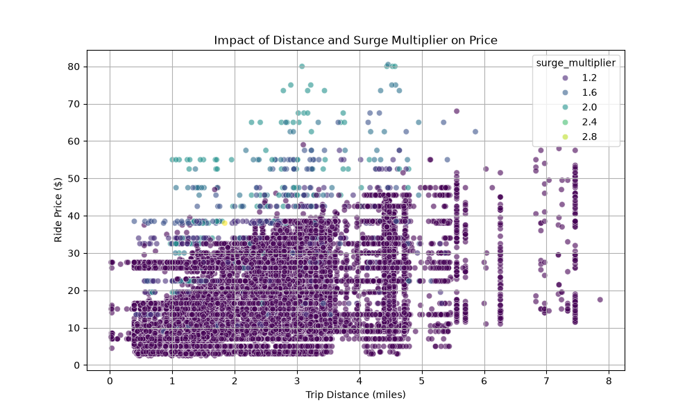

# Dynamic Pricing Optimization: A Causal and Machine Learning Approach


## Problem Statement
Dynamic pricing in ride-hailing networks requires balancing supply and demand in real-time. Traditional predictive models can forecast the price of a ride based on historical data, but they fail to answer the fundamental business question: *What is the causal effect of changing the surge multiplier on the final price, and how does this effect vary across different geographic locations and service types?* 

This project aims to bridge the gap between predictive modeling and decision science by estimating the Price Elasticity of demand using Double Machine Learning.

## Approach
This project is structured into three core phases:

1. **Spatial-Temporal Feature Engineering**: 
   - Utilized a large-scale dataset (~700k records) combining Uber/Lyft ride data with localized weather conditions.
   - Engineered cyclical temporal features (sine/cosine transformations of hours) to capture daily seasonality and mapped pickup coordinates to weather stations.

2. **Predictive Modeling (Ensemble)**:
   - Developed a robust baseline using Gradient Boosted Trees (XGBoost and LightGBM).
   - Achieved an R^2 score of 0.965 with a Mean Absolute Error (MAE) of $1.14 on the holdout test set.

3. **Causal Inference**:
   - Implemented Double Machine Learning (LinearDML via `EconML`) to estimate the Heterogeneous Treatment Effect (HTE).
   - Treated the `surge_multiplier` as the treatment variable and `price` as the outcome, while conditioning on spatial and temporal confounders.
   - Calculated the Average Treatment Effect (ATE) to quantify the exact monetary impact of a 1-unit increase in the surge multiplier, holding all other variables constant.

## Results
The causal inference engine yielded an Average Treatment Effect (ATE) of **+$8.03**. This indicates that, statistically holding distance, weather, and time constant, a 1-unit increase in the surge multiplier causes the baseline ride price to increase by $8.03.

The heterogeneity of this effect—how it varies based on trip distance and cab type—is visualized in the causal effect plot generated by the pipeline. 

**View the Causal Effect Visualization**:


## Repository Structure
```text
├── src/
│   ├── data/       # Data ingestion and preprocessing scripts
│   ├── features/   # Spatial/Temporal feature engineering
│   ├── models/     # Gradient Boosting baseline and ensemble scripts
│   └── causal/     # Causal inference & elasticity estimation
├── requirements.txt
└── README.md
```

## How to Run

1. **Environment Setup**:
```bash
python -m venv venv
source venv/bin/activate  # On Windows: venv\Scripts\activate
pip install -r requirements.txt
```

2. **Data Processing**:
Place the raw Uber/Lyft datasets into `src/data/raw/` and execute the feature engineering pipeline:
```bash
python src/features/build_features.py
```

3. **Model Training**:
Run the baseline XGBoost model or the Ensemble model. To log metrics to Weights & Biases, append the `--wandb` flag.
```bash
python src/models/train_xgb.py
python src/models/train_ensemble.py
```

4. **Causal Inference**:
Execute the causal engine to calculate the Average Treatment Effect and generate the heterogeneity plots.
```bash
python src/causal/elasticity.py
```

5. **API & Optimization Engine**:
Start the FastAPI server which exposes endpoints for price prediction and surge optimization.
```bash
uvicorn src.api.app:app --reload
```
Once running, visit `http://localhost:8000/docs` to interact with the API or test the optimizer via curl:
```bash
curl -X 'POST' \
  'http://localhost:8000/optimize' \
  -H 'accept: application/json' \
  -H 'Content-Type: application/json' \
  -d '{
  "distance": 2.5,
  "cab_type": "Uber",
  "name": "UberX",
  "temp": 65.0,
  "clouds": 0.5,
  "pressure": 1012.0,
  "rain": 0.0,
  "humidity": 0.6,
  "wind": 5.0,
  "day_of_week": 2,
  "hour_sin": 0.5,
  "hour_cos": 0.8
6. **Visual Dashboard (Streamlit)**:
To see a beautiful, interactive web interface of the Pricing Optimizer, run the Streamlit dashboard:
```bash
streamlit run streamlit_app.py
```
This will open a browser window where you can adjust ride parameters with sliders and see the optimal surge multiplier calculated in real-time. 

**Deployment**: This dashboard is designed to be easily hosted for free on [Streamlit Community Cloud](https://streamlit.io/cloud) by simply linking this GitHub repository!
